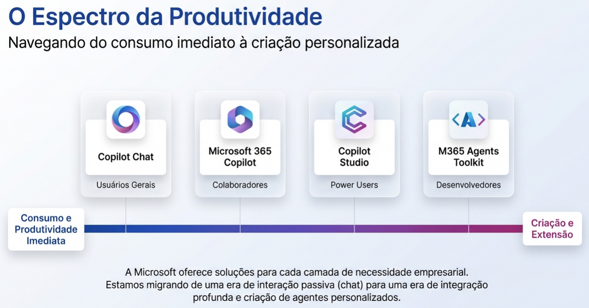
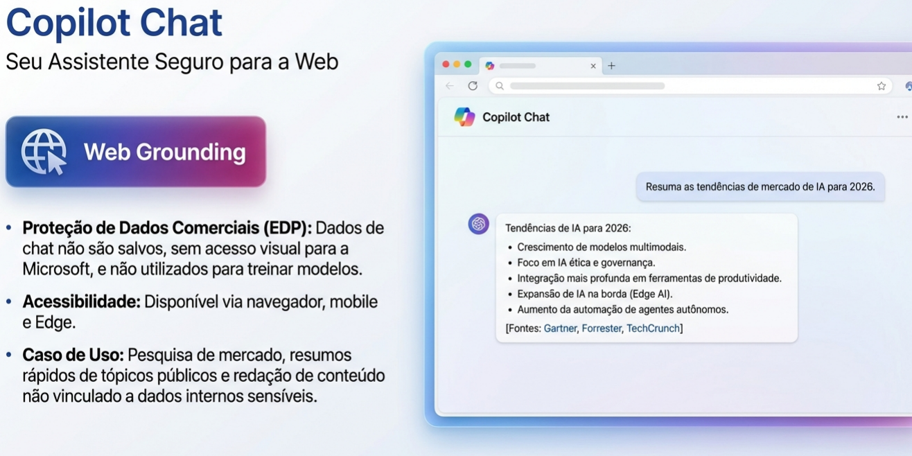
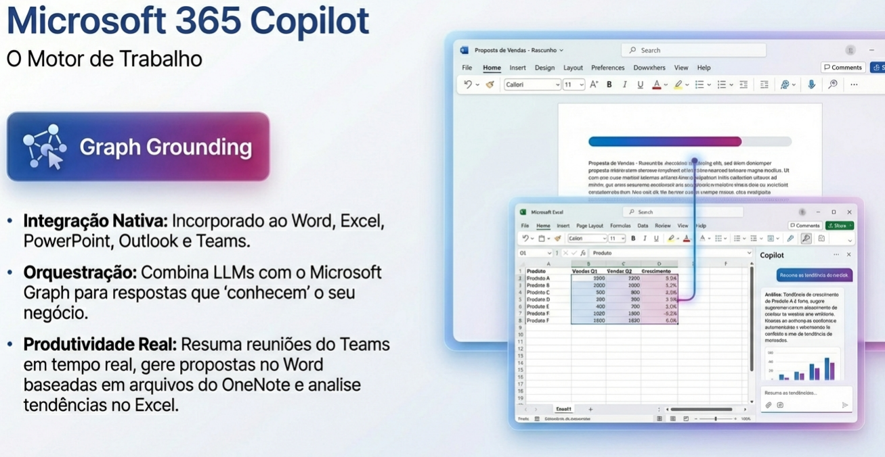
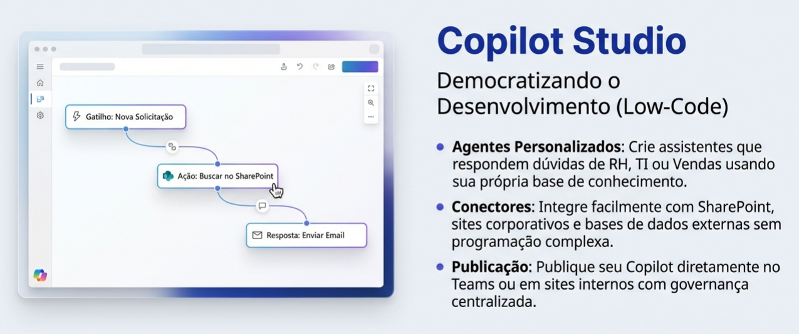
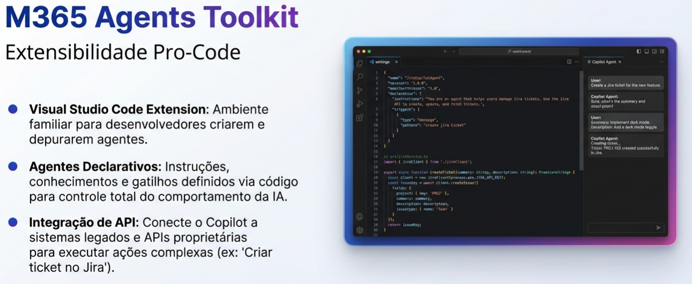

# Trilha de Aprendizagem Copilot

Este repositório descreve uma trilha de aprendizagem progressiva sobre o **Microsoft Copilot**, organizada em quatro níveis de maturidade técnica.

A proposta da trilha é conduzir o aluno desde o primeiro contato com o Copilot até a criação de soluções avançadas utilizando extensões e SDKs, respeitando uma progressão lógica de complexidade, autonomia e impacto.

## Visão Geral da Trilha

A trilha está organizada em quatro níveis:

1. **Copilot Explorer** – Introdução ao **Copilot Chat**  
2. **Copilot Specialist** – Uso do **Microsoft 365 Copilot**  
3. **Copilot Expert** – Criação de copilots com **Copilot Studio**  
4. **Copilot Hero** – Extensão e desenvolvimento com **M365 Agents Toolkit**  

> [!NOTE]
> Cada nível aprofunda o uso da IA, ampliando o grau de controle, personalização e integração com sistemas e processos.

## 🛡️ Copilot Explorer  
### 🤖 Copilot Chat

### Objetivo do nível
Apresentar o Copilot como assistente de IA conversacional, explicando seus fundamentos, possibilidades de uso e limitações.  
Este nível é focado em **compreensão e uso básico**, sem necessidade de conhecimento técnico avançado.

### O que é o Copilot Chat
O Copilot Chat é uma interface conversacional baseada em inteligência artificial que permite ao usuário interagir por meio de linguagem natural para obter respostas, explicações, resumos e sugestões.

Ele funciona como um assistente geral, voltado para produtividade, aprendizado e apoio em tarefas do dia a dia.

### Para que serve
- Responder perguntas gerais e técnicas
- Explicar conceitos
- Gerar resumos e listas
- Apoiar estudos e pesquisas
- Auxiliar na criação de textos e ideias
- Ajudar na formulação de prompts

### Quem pode usar
- Usuários finais
- Técnicos iniciantes
- Profissionais de qualquer área
- Estudantes

> [!NOTE]
> Não exige conhecimento técnico prévio.

### Principais features
- Interface conversacional simples
- Respostas em linguagem natural
- Capacidade de resumir e explicar conteúdos
- Geração de textos e ideias
- Apoio à aprendizagem e pesquisa

### Restrições e limitações
- Não acessa dados internos da organização
- Não possui contexto corporativo (e-mails, arquivos, Teams, etc.)
- Não executa ações em sistemas
- Respostas precisam ser sempre validadas pelo usuário

## 🛡️ Copilot Specialist  
### 🤖 Microsoft 365 Copilot

### Objetivo do nível
Capacitar o aluno a utilizar o Copilot de forma **produtiva dentro do ambiente corporativo**, integrando a IA às ferramentas do Microsoft 365.

### O que é o Microsoft 365 Copilot
É o Copilot integrado às aplicações do Microsoft 365, como Word, Excel, PowerPoint, Outlook e Teams, utilizando os dados e permissões do ambiente corporativo do usuário.

### Para que serve
- Criar e revisar documentos
- Analisar dados no Excel
- Gerar apresentações automaticamente
- Resumir reuniões e e-mails
- Aumentar produtividade no trabalho diário

### Quem pode usar
- Profissionais de empresas com Microsoft 365
- Técnicos e analistas
- Usuários com licença adequada

### Principais features
- Integração nativa com apps do Microsoft 365
- Uso de dados corporativos respeitando permissões
- Contexto de trabalho real
- Geração e edição de conteúdo
- Apoio à tomada de decisão

### Restrições e limitações
- Depende de licenciamento
- Respeita rigorosamente permissões de acesso
- Qualidade depende da organização dos dados
- Não substitui validação humana

## 🛡️ Copilot Expert  
### 🤖 Copilot Studio

### Objetivo do nível
Ensinar o aluno a **criar copilots personalizados**, indo além do uso pronto e passando a construir experiências de IA adaptadas a cenários específicos.

### O que é o Copilot Studio
O Copilot Studio é uma plataforma para criação, customização e publicação de copilots, permitindo definir comportamentos, fluxos conversacionais e integrações.

### Para que serve
- Criar copilots específicos para áreas ou processos
- Integrar IA a dados e sistemas internos
- Automatizar atendimentos e fluxos
- Personalizar respostas e comportamentos

### Quem pode usar
- Técnicos intermediários
- Analistas de sistemas
- Profissionais de automação e TI
- Times de inovação

### Principais features
- Criação de fluxos conversacionais
- Integração com APIs e dados
- Customização de comportamento
- Publicação de copilots
- Integração com Power Platform

### Restrições e limitações
- Exige conhecimento técnico intermediário
- Depende de governança e segurança
- Requer planejamento de uso e dados
- Complexidade maior que os níveis anteriores

## 🛡️ Copilot Hero  
### 🤖 Microsoft 365 Agents Toolkit

### Objetivo do nível
Capacitar o aluno a **criar, estender e integrar agentes inteligentes no ecossistema Microsoft 365**, utilizando o Agents Toolkit para desenvolver soluções avançadas baseadas em IA, com alto grau de personalização e impacto organizacional.

Este nível representa o estágio mais avançado da trilha, onde o aluno deixa de apenas configurar copilots e passa a **desenvolver agentes completos**, integrados a sistemas, serviços e processos de negócio.

### O que é o Microsoft 365 Agents Toolkit
O Microsoft 365 Agents Toolkit é um conjunto de ferramentas e frameworks que permite criar **agentes personalizados para o Microsoft 365**, utilizando código, extensões e integrações com serviços externos.

Com ele, é possível desenvolver agentes que atuam de forma contextualizada em ambientes como Teams, Microsoft 365 e aplicações corporativas, indo além das capacidades visuais e declarativas do Copilot Studio.

### Para que serve
- Desenvolver agentes inteligentes personalizados
- Criar extensões avançadas para o ecossistema Microsoft 365
- Integrar agentes a APIs, serviços e sistemas corporativos
- Implementar lógica de negócio complexa
- Escalar e industrializar soluções baseadas em Copilot

### Quem pode usar
- Desenvolvedores
- Arquitetos de software
- Profissionais avançados de TI
- Times de engenharia, produto e inovação

> [!NOTE]
> Este nível é indicado para quem já domina o uso e a criação de copilots e deseja avançar para **desenvolvimento profissional de agentes**.

### Principais features
- Desenvolvimento baseado em código
- Criação de agentes customizados
- Integração com APIs e serviços externos
- Suporte a extensões no Microsoft Teams
- Controle avançado de lógica e comportamento
- Integração com o ecossistema Microsoft 365

### Restrições e limitações
- Exige conhecimento avançado de desenvolvimento
- Requer domínio de arquitetura de software
- Maior responsabilidade sobre segurança, governança e compliance
- Curva de aprendizado elevada
- Necessita planejamento cuidadoso para manutenção e escala

## Conclusão

Esta trilha foi desenhada para acompanhar a evolução natural do uso do Copilot:

- **Entender** → Copilot Chat  
- **Usar no trabalho** → Microsoft 365 Copilot  
- **Criar soluções** → Copilot Studio  
- **Estender e integrar** → Microsoft 365 Agents Toolkit  

Cada nível prepara o aluno para o próximo, garantindo uma progressão consistente e sustentável no uso da inteligência artificial.
